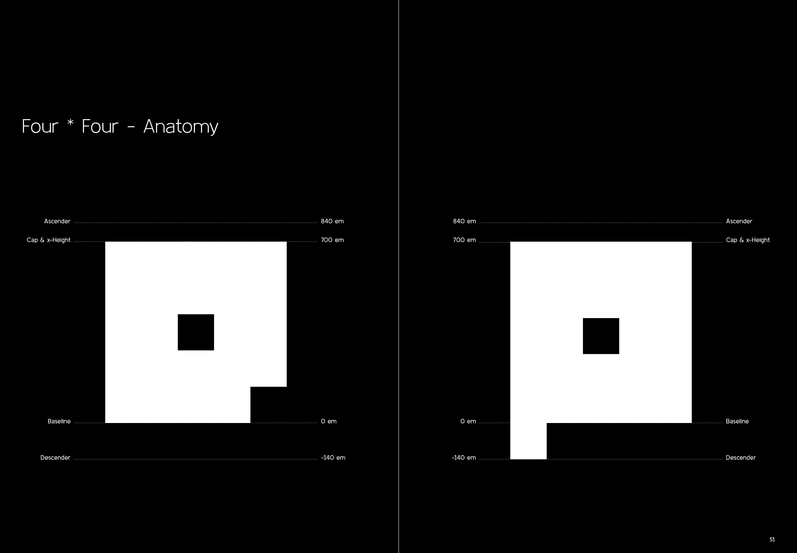
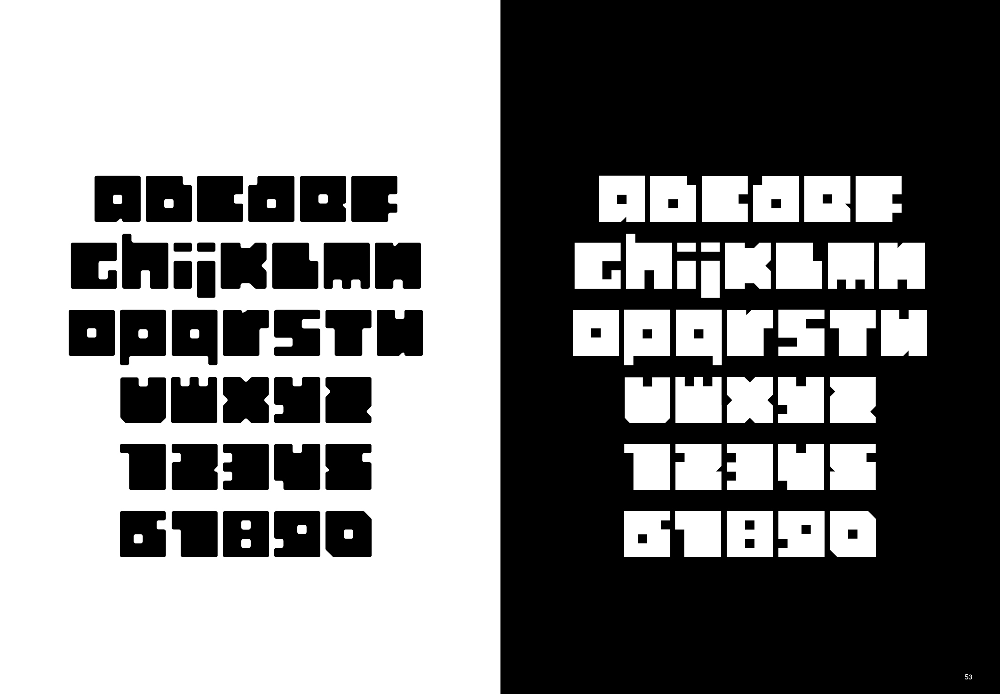
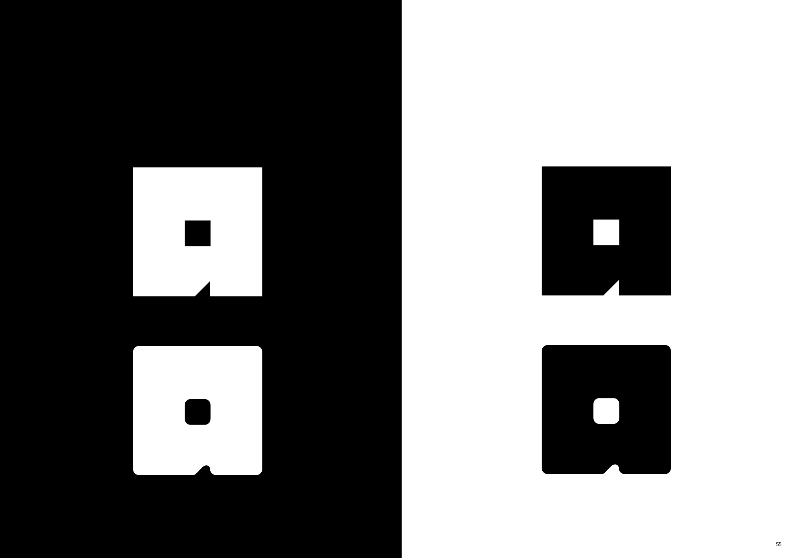
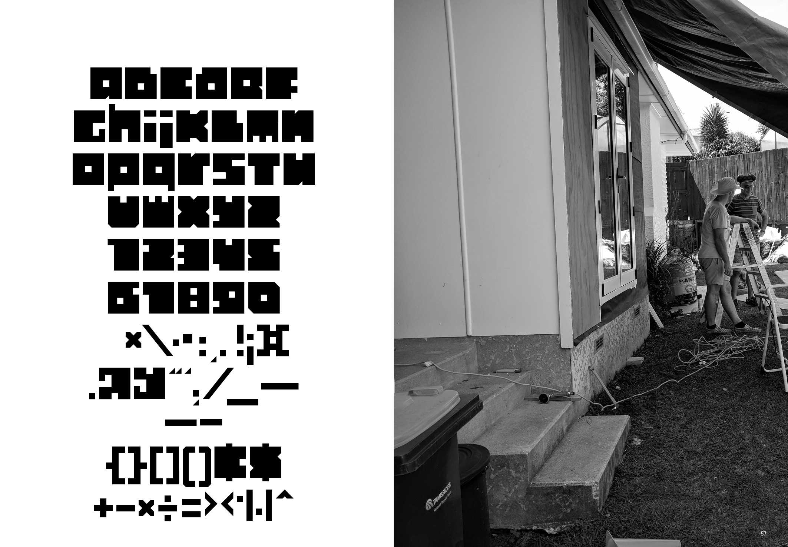
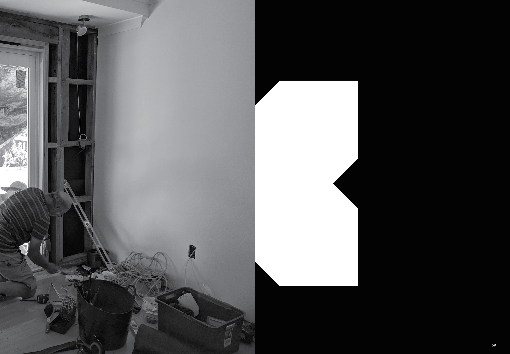

## Four * Four

Kulim Park is a humanist sans serif typeface, with high x-height, open counter ‘a’, minimal degrees of contrast in stem width, inviting bowls and a design language aimed at encapsulating openness.

### Project documentation

Four * Four is part of a larger series of site specific typefaces completed as part of a masters project. Further details regarding this typefaces development are available here, [Project overview](docs/project-overview.md).

### Available weights
Rough Sawn  
Dressed  

